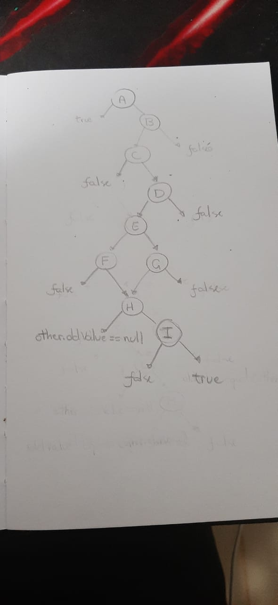

# Testes-de-Software-2021.1-jabref-wiki

Esse repositório tem como objetivo registrar a tabela de condição utilizada para refinar o teste do repositório [jabref](https://github.com/JabRef/jabref)

## GFC

Como demonstrado na imagem, o esquemático do fluxo de retorno baseado em cada decisão e condição. Algumas condições não foram levadas em conta pelo código em si em outros momentos garantir certas condições, sendo assim, nesse caso, daria para remover algumas decisões e checagens.

## Tabela de múltiplas condições

| D | Condição | Situação para true | Situação para false |
| - | -------- | ------------------ | ------------------- |
| A | this == obj | this == obj | this != obj |
| B | obj instanceof FieldChange | Se obj for uma instancia de FieldChange | se obj não for uma instância de FieldChange |
| C | !entry.equals(other.entry) | this.entry != other.entry | this.entry == other.entry | 
| D | !field.equals(other.field) | this.field != other.field | this.field == other.field |
| E | newValue == null | Se newValue for nulo | Se newValue for diferente de nulo |
| F | other.newValue != null | other.newValue != null | other.newValue == null |
| G | !newValue.equals(other.newValue) | this.newValue != other.newValue | this.newValue == other.newValue|
| H | oldValue == null | this.oldValue != other.oldValue | this.oldValue != other.oldValue |
| I | !oldValue.equals(other.oldValue) | this.oldValue != other.oldValue | this.oldValue == other.oldValue |
